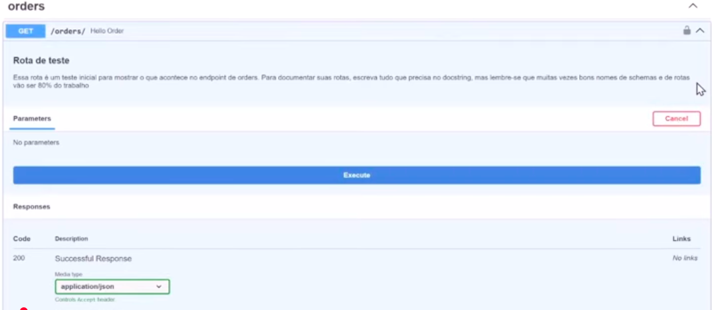

# Rest API com Python (Backend Completo)

---

O que é o FastAPI, conforme descrito em vídeo o FastApi, é uma como se fosse *"A estrutura do Python, que permite construir a parte de Backend de um site"*.

No caso da `"Framework"` do FastApi, ele cria os nomeados de end-points, de um site que basicamente é o link de um site sucedido de `/endpoin`, na prática, e como se tivéssemos o link do site para o sistema a ser construído, e pegássemos um método ou para fazer uma determinada coisa, o FastAPI, constrói a documentação dessa API, seguindo alguns preceitos que serão vistos posteriormente.

Outro ponto importante que foi apresentado na aula, é que através do FastAPI, é possível realizar o teste dos endpoint do site (a partir daqui os `endpoint's` serão denominado de links do site.), conforme demonstrado abaixo:    

> <table style="text-align: center; width: 100%;"> 
> <tr>
> <td style="text-align: center;">
> 
> </td>
> </tr>
> </table>

---

## Sobre o projeto
O projeto que será desenvolvido terá como objetivo criar uma API utilizando o FastAPI,com os links do site, devidamente documentos e executáveis.  
Mais especificamente nesse projeto será criado todas as rotas (Links do site), assim como todas as funcionalidades correspondentes.

### Divisão do projeto de curso.

Para que um projeto em `FastAPI` possa funcionar corretamente recomenda-se que ele tenha uma certa divisão em seus arquivos do projeto, onde um tenha um arquivo de `main`, esse arquivo tem como objetivo criar o `FastAPI`, definir suas configurações tais como questões de criptografia e define-se as rotas da sua API.
> OBS: As rotas ou endpoint's de uma API nada mais são que o endereço final do site.  
Para além do que fora descrito acima faz-se necessário também que tenhamos criado dentro do projeto os arquivos de rotas, que nada mais é que os arquivos onde estarão presentes as configurações dos endpoint's.  
Porém para tudo que isso funcione conforme esperado precisamos de outros arquivos/modelos que auxiliem nesse projeto, sendo eles:  
- 1º Banco de dados.
- 2º Um arquivo de models
  - > Esse arquivo nada mais é que um meio de definir quais serão as tabelas do banco de dados.
- 3º Um arquivo de dependências.
  - > Essse arquivo é responsável por permitir algumas configurações, sejam de somente usuários autenticados realizarem certas ações, definições de ordem nas requisições etc..
- 4º Um arquivo de Schemas
  - > Esse arquivo é responsável por criar as estruturas padrões do `FASTAPI` para que possamos ter um processo mais eficiênte.
---

Diferentemente do comportamento padrão do `Python` no qual temos uma linguagem de programação que não é tipaada, ou pouco tipada, o `FastAPI` exige em sua utilização uma definição dos tipos das variáveis, por mais que esse tipo de escrita seja maior isso permite maior agilidade no processamento do `FASTAPI`, pois ele já espera que certas coisas sejam de um tipo determinado por exemplo, torando assim também com que a execução do projeto seja mais leve e performático. 

---

## Inicializando o Projeto
Assim como em outros projetos presentes nesse repositório nesse também iremos trabalhar com um arquivo de [requirements](https://github.com/thierryLchaves/Notacoes_Hastag_FastAPI/blob/fa004b0b6d56fa4da8beeb0e9bfbfe0035a03fca/src/requirements.txt) que conterá todas as bibliotecas necessárias pra utilização
para que possamos iniciar o projeto os sequintes comandos devem ser executados no `bahs`. 
1º Comandos para ativação de um ambiente virtual Python 
```bash
CD pasta_proejto/
python -m venv .venv

source .venv/Scripts/activate
```

2º Instalando as dependências
```bash
python.exe -m pip install --upgrade pip
pip install -r requirements.txt 
```

Com o ambiente devidamente configurado e com as dependências instaladas podemos iniciar o projeto.

---

Mesmo que possuimos todas as bibliotecas necessárias que estão presentes dentro do [requirements](https://github.com/thierryLchaves/Notacoes_Hastag_FastAPI/blob/fa004b0b6d56fa4da8beeb0e9bfbfe0035a03fca/src/requirements.txt), iremos descorrer sobre algumas das principais bibliotecas que devem estar presentes nesse projeto para seu correto funcionamento.  
- `fastapi` essa framework, e uma das principais se não a principal dentro desse projeto, ela que nos irá permitir realizar o projeto em sí. 
- `uvicorn` essa é uma framework, que é conhecida também como um <a href="#ref01"> __ASGI SERVER__ </a> isso nada mais é que um gerenciador do nosso servidor, que possibilita gerenciar requisições de forma asincrona
- `sqlalchemy` esse é responsável por realizar a tradução da estrutura do banco de dados que serão traduzidas em tabelas nesse banco efetivamente.
- `passlib[bcrypt]` esse é responsável pelo processo de criptográfia das senhas de uma forma segura.
- `python-jose[cryptography]` esse é reponsável pelo processo de criação dos  <a href="#ref01"> __Tokens JWT__ </a>  basicamente quando estamos consumindo uma API, é possível de ser criado um sistema de autênticação nessa API, isso serve para por exemplo torcar o processo de autenticação via código com E-mail por exemplo, pois dentro do token que é criado temos algumas informações embedadas, porém esses estão no formato JSON por isso JWT Json Web Token, em suma esse é o pacote responsável por criar e gerenciar esses tokens.  
- `python-dontev` Esse é o responsável por realziar o gerenciamento de variaveis de ambiente.  
- `python-multipart` Ele é uma dependência do `Python-jose`, mas por precaução será instalado individualmente.

<details id="ref01">
    <summary> ASGI SERVER </summary>
    <p>O ASGI (Asynchronous Server Gateway Interface) é uma especificação de interface de servidor espiritual sucessora do WSGI, projetada para permitir que aplicações Python lidem de forma assíncrona com protocolos web modernos.</p>
    <ul>
        <li><strong>Suporte a Concorrência Assíncrona:</strong> Permite gerenciar múltiplos eventos simultâneos sem bloquear a execução do servidor, sendo ideal para aplicações que utilizam `async/await`.</li>
        <li><strong>Protocolos Modernos:</strong> Além do HTTP tradicional, o ASGI suporta nativamente WebSockets, HTTP/2 e conexões de longa duração (Long-Polling), essenciais para aplicações em tempo real.</li>
        <li><strong>Implementações Comuns:</strong> É a base utilizada por servidores como Uvicorn, Daphine e Hypercorn para rodar frameworks de alta performance como FastAPI e Django Channels.</li>
    </ul>
</details>

<details id="ref02">
    <summary>Tokens JWT</summary>
    <p>O JWT é um padrão da indústria (RFC 7519) utilizado para transmitir informações de forma segura entre as partes como um objeto JSON, sendo amplamente adotado em autenticações Stateless (sem estado) de APIs Rest.</p>
    <ul>
        <li><strong>Estrutura em Três Partes:</strong> É composto por três strings separadas por pontos: Header (algoritmo de criptografia), Payload (os dados/claims do usuário) e Signature (a assinatura que garante a integridade do token).</li>
        <li><strong>Autenticação Stateless:</strong> O servidor não precisa armazenar a sessão do usuário em banco de dados ou memória (RAM); toda a informação necessária para validar o acesso está embutida de forma criptografada no próprio token.</li>
        <li><strong>Segurança por Assinatura:</strong> Embora o conteúdo possa ser facilmente decodificado (Base64), ele não pode ser alterado por terceiros sem invalidar a assinatura, que depende de uma chave secreta exclusiva do servidor.</li>
    </ul>
</details>

---
Com essa instalação podemos dar o seguimento no projeto, e antes realizamos os códigos etc.. iremos nos ater a uma coisa, quando estamos trabalhando com o `uvircon`, para que nosso servidor esteja online sempre será necessário realizar o seguinte comando no terminal:  
```bash
uvicorn main:app --reload
```
esse comando faz com que executamos o nosso asgi server, e passamos como argumento o nome do arquivo principal que no caso chamamos de main, e pós o `:` inserimos o app que é uma variavel no `fastapi`, outro ponto sobre o comando acima, e que temos o parâmetro de `--reload` isso nos possibilita que não seja necessário realizar a pausa do sistema a cada alteração que pode ser feita.
Com isso terminamos nossa primeira aula.  
